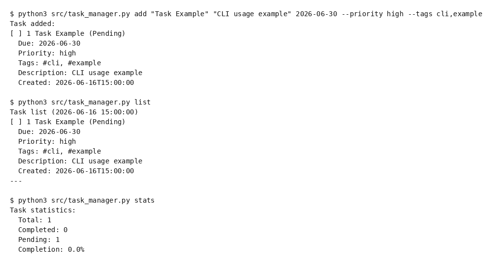

# 📋 Task Manager

[](https://opensource.org/licenses/MIT)
[](https://www.python.org/downloads/)
[](https://github.com/Woollest/task-manager)

A simple yet powerful command-line task manager. With JSON storage, no setup required, ready to use immediately.

## ✨ Features

- ✅ **Task Management**: Add, complete, delete, update, search
- 🎯 **Priority & Tags**: Task categorization and prioritization
- 📅 **Date Filtering**: Filter and sort by due date
- 📊 **Statistics**: Get a quick overview of your task progress
- 💾 **JSON Storage**: Lightweight, no external tools needed
- 🚀 **Easy Setup**: One command with `bash setup.sh`
- 📖 **Complete Documentation**: Japanese and English support
- 🎓 **Demo Script**: Run `bash demo.sh` to see all features

## 🚀 Quick Start

### Setup in 1 minute

```bash
# Clone the repository
git clone https://github.com/Woollest/task-manager.git
cd task-manager

# Run setup (first time only)
bash setup.sh

# Display your tasks
python3 src/task_manager.py list
```

### Demo

Automatically demonstrates all features.

```bash
bash demo.sh
```

## 📖 Usage

### Basic Commands

```bash
# Show help
python3 src/task_manager.py --help

# Add a task
python3 src/task_manager.py add "Title" "Description" 2026-06-30 \
  --priority high --tags work,urgent

# Complete a task
python3 src/task_manager.py complete 1

# Delete a task
python3 src/task_manager.py delete 1

# Update a task
python3 src/task_manager.py update 1 \
  --title "New title" --priority low

# List tasks with filters and sorting
python3 src/task_manager.py list \
  --pending --tag work --sort priority

# Search tasks
python3 src/task_manager.py search "keyword"

# Show statistics
python3 src/task_manager.py stats
```

### Advanced Options

#### `list` Command

```bash
# Show only pending tasks
python3 src/task_manager.py list --pending

# Filter by tag
python3 src/task_manager.py list --tag work

# Filter by priority
python3 src/task_manager.py list --priority high

# Filter by date range
python3 src/task_manager.py list \
  --due-after 2026-06-01 --due-before 2026-06-30

# Sort by (due | priority | created)
python3 src/task_manager.py list --sort priority
```

#### `add` Command

```bash
# Basic format
python3 src/task_manager.py add "Title" "Description" YYYY-MM-DD

# With priority (low | normal | high)
python3 src/task_manager.py add "Shopping" "Milk and eggs" 2026-06-20 \
  --priority high

# With tags (comma-separated)
python3 src/task_manager.py add "Meeting" "Project discussion" 2026-06-18 \
  --priority normal --tags meeting,team
```

### Change Storage File

By default, tasks are saved to `tasks.json`. To use a different file:

```bash
python3 src/task_manager.py --storage ./my_tasks.json add "Task" "Description" 2026-06-30
```

## 📸 Usage Screenshot



## 🏗️ Project Structure

```
task-manager/
├── src/
│   └── task_manager.py      # Main tool
├── tests/                    # Test directory
├── README.md                 # Japanese README
├── README.en.md              # This file (English)
├── LICENSE                   # MIT License
├── CHANGELOG.md              # Change history
├── setup.sh                  # Setup script
├── demo.sh                   # Demo script
├── requirements.txt          # Dependencies
├── .gitignore                # Git configuration
└── usage_screenshot.png      # Screenshot
```

## 📋 Task Format

Each task contains the following information:

```json
{
  "id": 1,
  "title": "Task title",
  "description": "Task description",
  "due_date": "2026-06-30",
  "priority": "high",
  "tags": ["work", "urgent"],
  "completed": false,
  "created_at": "2026-06-16T12:34:56"
}
```

## ⚙️ Requirements

- Python 3.8 or higher
- No additional packages required (standard library only)

## 📝 Local Configuration

- `tasks.json` is used for local task storage
- It is excluded from git (see `.gitignore`), so it won't be committed
- Multiple environments can maintain independent task lists by cloning this repository

## 🔄 Data Persistence

Task information is stored in JSON format in `tasks.json`:

- **Auto-save**: Tasks are saved automatically after each operation
- **Portable**: JSON format is compatible with other tools
- **Extensible**: Can be replaced with a database if needed

## 📄 License

MIT License - See [LICENSE](LICENSE) file

For detailed changelog, see [CHANGELOG.md](CHANGELOG.md).

## 🤝 Contributing

Feature requests and bug reports are welcome at [GitHub Issues](https://github.com/Woollest/task-manager/issues).

---

**Happy Task Managing! 🎯**
